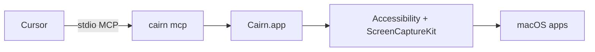

# Cairn

> *Cairn — native macOS control for AI agents through MCP.*

**Let AI agents drive your Mac desktop** — list windows, read UI trees, click, type, and scroll through a native MCP server. Cursor-first today, host-agnostic by design (any stdio-MCP client works).

[](./LICENSE)
[](#mcp-tools)
[-lightgrey)](./docs/macOS-26.md)
[](./docs/CURSOR.md)

---

## Why use this

| | Cairn | Legacy `computer-use-mcp` |
|---|---------------------|---------------------------|
| Tools in Cursor | **9** named tools (`list_apps`, `click`, …) | 1 bundled `computer` tool |
| Runtime | Swift + **Cairn.app** (own permissions) | Node + screen coordinates |
| Built for | Cursor install, policy, Composer hints, skill pack | Generic npm package |

Agents work from **accessibility trees and `element_index`**, not guesswork on pixel coordinates. Permissions live on **Cairn.app**, so you are not granting screen recording to Terminal or Cursor itself.

## Requirements

- **macOS 26 (Tahoe)** or later for this repository’s native build
- **Cursor** with MCP enabled
- **Accessibility** and **Screen Recording** for **Cairn.app** (the installer walks you through this)

## Quick start

```bash
npm run npm:build
cairn install-cursor-mcp
cairn doctor
```

Then in Cursor:

1. **Settings → MCP** — turn on **`cairn`** and confirm you see **9 tools**.
2. Turn off legacy **`computer-use-mcp`** if it is still listed (avoids duplicate automation).
3. *(Optional)* Copy [`.cursor/cairn-policy.example.json`](./.cursor/cairn-policy.example.json) → `.cursor/cairn-policy.json` to restrict apps (e.g. password managers).

**Troubleshooting and Composer workflow:** [docs/CURSOR.md](docs/CURSOR.md)

## MCP tools

| Tool | What it does |
|------|----------------|
| `list_apps` | Running apps you can target |
| `get_app_state` | Accessibility tree (+ optional screenshot); call before/after actions |
| `click` | Activate a control by `element_index` |
| `perform_secondary_action` | Right-click / secondary action |
| `scroll` | Scroll a control or region |
| `drag` | Drag between elements |
| `type_text` | Type into focused UI |
| `press_key` | Key chords and shortcuts |
| `set_value` | Set text field values directly |

Typical loop: **`list_apps` → `get_app_state` → act → `get_app_state` again** to verify. Prefer **`element_index`** over raw coordinates.

## How it works



The CLI talks to **Cairn.app**, which holds TCC permissions and performs automation. Cursor never needs direct Accessibility access.

## What you get in this repo

- **`install-cursor-mcp`** — wires MCP into Cursor (project or user scope)
- **Policy** — optional allow/deny lists; password managers denied by default ([docs/FORK.md](docs/FORK.md))
- **Set-of-Mark screenshots** — numbered overlays on `get_app_state` PNGs; optional Apple Vision OCR
- **Skill + plugin** — [skills/cairn/](skills/cairn/SKILL.md), [plugins/cairn/](plugins/cairn/) (`.cursor-plugin/plugin.json`)
- **macOS 26 notes** — capture and permission hardening ([docs/macOS-26.md](docs/macOS-26.md))
- **Benchmarks** — `npm run benchmark` ([docs/BENCHMARK.md](docs/BENCHMARK.md))

## Build and test

```bash
swift build && swift test
./scripts/run-tool-smoke-tests.sh
BENCHMARK_TRIALS=1 npm run benchmark
```

## Documentation

| Doc | Purpose |
|-----|---------|
| [docs/CURSOR.md](docs/CURSOR.md) | Install, permissions, Composer workflow |
| [docs/README.md](docs/README.md) | Full documentation map |
| [docs/macOS-26.md](docs/macOS-26.md) | Tahoe capture and permissions |
| [docs/ARCHITECTURE.md](docs/ARCHITECTURE.md) | Linux/Windows and other MCP clients |
| [AGENTS.md](AGENTS.md) | Agent navigation |

## Other MCP clients

Any host that supports local stdio MCP can run `cairn mcp` with the same nine tools. Platform-specific notes: [docs/ARCHITECTURE.md](docs/ARCHITECTURE.md).

## Heritage

Cairn started as a Cursor-flagship fork of [`iFurySt/open-codex-computer-use`](https://github.com/iFurySt/open-codex-computer-use). The macOS-native flagship lives here under the **Cairn** name; the upstream Linux/Windows runtime ports retain the historical `open-computer-use` binary name (see [docs/REBRAND.md](docs/REBRAND.md) for the naming decision).

## License

[MIT](./LICENSE) — derived work notice: [ATTRIBUTION.md](ATTRIBUTION.md)
