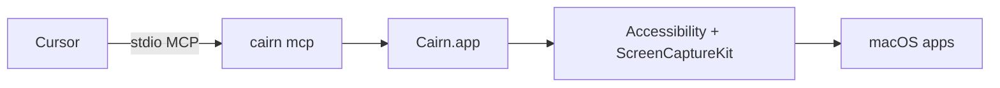

# Cairn

> *Cairn — native macOS control for AI agents through MCP.*

[](./LICENSE)
[](https://cursor.com)
[](#the-9-tools)
[-lightgrey)](./docs/macOS-26.md)

Cairn is a native macOS MCP server that lets a Cursor agent see and drive real Mac apps using accessibility trees and screenshots. Permissions are held by a dedicated **Cairn.app**, so Cursor itself never gets Accessibility access — and your agent works from numbered UI elements (`element_index`) instead of guessing pixel coordinates.

---

## Requirements

- **macOS 26 (Tahoe)** or later
- **Cursor 3.5.x** (Settings → MCP & Plugins)
- **Node.js 20+** on `PATH` (for `npm`)

## Install

### Step 1 — Install the CLI

```bash
npm install -g cairn-computer-use
```

This installs the `cairn` command and bundles **Cairn.app** for macOS.

### Step 2 — Grant macOS permissions

```bash
cairn doctor
```

`cairn doctor` walks you through granting **Accessibility** and **Screen Recording** to **Cairn.app** — not Terminal, not Cursor. The dedicated `.app` is where the permissions live, so Cursor never needs direct system access.

> Upgrading from an older `Open Computer Use.app` install? The bundle id changed to `com.powerbeef.cairn`, so macOS treats it as a new app for TCC. Remove the old grants under System Settings → Privacy & Security, then re-grant them to **Cairn.app**. See the [TCC migration note](./docs/REBRAND.md#tcc-migration-note).

### Step 3 — Connect Cairn to Cursor 3.5.x

Pick one of the three flows below. They all land on the same MCP server entry.

#### Option A — One command (recommended)

```bash
cairn install-cursor-mcp                  # user scope: ~/.cursor/mcp.json
cairn install-cursor-mcp --scope project  # project:    ./.cursor/mcp.json
```

Then restart Cursor.

#### Option B — Cursor Settings UI

1. Open **Cursor → Settings → MCP & Plugins**.
2. Click **Add new MCP server**.
3. Fill in:
   - **Name:** `cairn`
   - **Command:** `cairn`
   - **Args:** `mcp`
4. **Save**, then toggle the server **on**.

#### Option C — Manual `mcp.json`

Copy this into `~/.cursor/mcp.json` (user scope) or `./.cursor/mcp.json` (project scope). It matches the template in [.cursor/mcp.json](./.cursor/mcp.json):

```json
{
  "mcpServers": {
    "cairn": {
      "command": "cairn",
      "args": ["mcp"]
    }
  }
}
```

### Step 4 — Verify in Cursor

- Open **Cursor → Settings → MCP & Plugins**.
- Confirm **`cairn`** is enabled and shows **9 tools**.
- If `computer-use-mcp` (a legacy server with one bundled `computer` tool) is listed, **toggle it off** so the agent does not run two competing automation servers.

## Try it (first prompt)

Open Composer and paste:

```
Use cairn: list_apps, then get_app_state for Finder, then read the toolbar buttons by element_index.
```

Two tips that make every Cairn run smoother:

- Prefer **`element_index`** over coordinate clicks — the accessibility tree is the source of truth.
- Always re-check with **`get_app_state`** after an action; the UI may have changed.

## The 9 tools

| Tool | What it does |
|------|----------------|
| `list_apps` | Running apps you can target |
| `get_app_state` | Accessibility tree (+ optional screenshot); call before/after actions |
| `click` | Activate a control by `element_index` |
| `perform_secondary_action` | Right-click / secondary action |
| `scroll` | Scroll a control or region |
| `drag` | Drag between elements |
| `type_text` | Type into focused UI |
| `press_key` | Key chords and shortcuts |
| `set_value` | Set text field values directly |

Typical loop: **`list_apps` → `get_app_state` → act → `get_app_state` again** to verify.

## How it works



The CLI talks to **Cairn.app**, which holds TCC permissions and performs the automation. Cursor never needs direct Accessibility access.

## Optional: restrict apps with a policy

Block password managers (and anything else you choose) before the agent can ever target them:

```bash
cp .cursor/cairn-policy.example.json .cursor/cairn-policy.json
```

The example denylist already covers `com.apple.Passwords` and common password managers. See [docs/FORK.md](./docs/FORK.md) for the policy schema.

## Troubleshooting

- **`cairn` not found after npm install** — reopen your shell so the new `PATH` is picked up, or check `npm bin -g`. If you use `nvm` or similar, confirm the active Node version owns the global bin.
- **Cursor shows 0 tools for `cairn`** — run `cairn doctor --cursor` (preflights macOS 26, PATH, and `~/.cursor/mcp.json`), then fully restart Cursor.
- **Permission prompt keeps reappearing** — macOS may still be remembering an older `Open Computer Use.app` install. Open System Settings → Privacy & Security → Accessibility (and → Screen Recording), remove the old entry, then run `cairn doctor` again so it can re-prompt for **Cairn.app**.

Full troubleshooting matrix and Composer workflow: [docs/CURSOR.md](./docs/CURSOR.md).

## Other MCP clients

Any host that supports local stdio MCP can run `cairn mcp` with the same nine tools. Platform-specific notes: [docs/ARCHITECTURE.md](./docs/ARCHITECTURE.md).

## For contributors

```bash
git clone https://github.com/PowerBeef/cairn-computer-use
cd cairn-computer-use
swift build && swift test
./scripts/run-tool-smoke-tests.sh
```

- Agent navigation and repo workflow: [AGENTS.md](./AGENTS.md)
- Pull request and review process: [CONTRIBUTING.md](./CONTRIBUTING.md)
- Full documentation map: [docs/README.md](./docs/README.md)

## Documentation

| Doc | Purpose |
|-----|---------|
| [docs/CURSOR.md](./docs/CURSOR.md) | Install, permissions, Composer workflow |
| [docs/macOS-26.md](./docs/macOS-26.md) | Tahoe capture and permissions |
| [AGENTS.md](./AGENTS.md) | Agent navigation |

See [docs/README.md](./docs/README.md) for the full documentation map.

## Heritage

Cairn started as a Cursor-flagship fork of [`iFurySt/open-codex-computer-use`](https://github.com/iFurySt/open-codex-computer-use). The macOS-native flagship lives here under the **Cairn** name; the upstream Linux/Windows runtime ports retain the historical `open-computer-use` binary name (see [docs/REBRAND.md](./docs/REBRAND.md) for the naming decision).

## License

[MIT](./LICENSE) — derived work notice: [ATTRIBUTION.md](./ATTRIBUTION.md)
