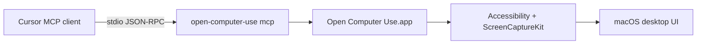

# Cursor Computer Use

**MCP server for native macOS desktop automation in Cursor** — nine Codex-style tools over Accessibility and ScreenCaptureKit, without a Node wrapper.

[](./LICENSE)
[](./docs/CURSOR.md)
[-lightgrey)](./docs/macOS-26.md)

## What it is

Cursor Computer Use connects Cursor to the macOS desktop through a local MCP server. Agents can list apps, read accessibility trees, click, type, scroll, and verify UI state using the same nine-tool surface as Codex Computer Use — implemented in Swift and exposed as `open-computer-use mcp`.

- **Cursor-first:** `install-cursor-mcp`, Composer-tuned tool descriptions, optional policy files, and a dedicated skill pack
- **Native runtime:** `OpenComputerUseKit` + **Open Computer Use.app** (not Terminal/Cursor) holds Accessibility and Screen Recording permissions
- **No hybrid MCP:** one stdio server, nine tools — not a single bundled `computer` tool from legacy packages

## Requirements

- **macOS 26 (Tahoe) or later** for the native build in this repository
- **Accessibility** and **Screen Recording** granted to **Open Computer Use.app**
- **Cursor** with MCP enabled

## Quick start

```bash
npm run npm:build
open-computer-use install-cursor-mcp
open-computer-use doctor
```

1. In **Cursor → Settings → MCP**, enable **`cursor-computer-use`** (expect **9 tools**).
2. Disable legacy **`computer-use-mcp`** if present (single `computer` tool).
3. Optional: copy [`.cursor/computer-use-policy.example.json`](./.cursor/computer-use-policy.example.json) to `.cursor/computer-use-policy.json`.

Full workflow and troubleshooting: **[docs/CURSOR.md](docs/CURSOR.md)**.

## Features

| Area | Details |
|------|---------|
| MCP tools | `list_apps`, `get_app_state`, `click`, `perform_secondary_action`, `scroll`, `drag`, `type_text`, `press_key`, `set_value` |
| Policy | Denylist for password managers and **Passwords**; optional allow/deny lists — see [docs/FORK.md](docs/FORK.md) |
| macOS 26 | ScreenCaptureKit hardening and Tahoe permission notes — [docs/macOS-26.md](docs/macOS-26.md) |
| Agent skill | [skills/cursor-computer-use/SKILL.md](skills/cursor-computer-use/SKILL.md) |
| Plugin | [plugins/cursor-computer-use/](plugins/cursor-computer-use/) with `.mcp.json` |
| Benchmarks | `npm run benchmark` — [docs/BENCHMARK.md](docs/BENCHMARK.md) |

## How it works



The CLI launches or talks to **Open Computer Use.app**, which performs automation under its own TCC identity. Responses include accessibility trees and optional screenshots for `element_index`-based actions.

## Build and test

```bash
swift build && swift test
./scripts/run-tool-smoke-tests.sh
BENCHMARK_TRIALS=1 npm run benchmark
```

## Documentation

| Doc | Purpose |
|-----|---------|
| [docs/README.md](docs/README.md) | Full documentation map |
| [docs/CURSOR.md](docs/CURSOR.md) | Install, permissions, Composer workflow |
| [docs/macOS-26.md](docs/macOS-26.md) | Tahoe capture and permissions |
| [AGENTS.md](AGENTS.md) | Agent navigation |

## Other MCP clients

Any client that supports local stdio MCP can run `open-computer-use mcp` with the same nine tools. Platform notes for Linux and Windows builds live in [docs/ARCHITECTURE.md](docs/ARCHITECTURE.md).

## License

[MIT](./LICENSE)

Derived work notice: [ATTRIBUTION.md](ATTRIBUTION.md)
